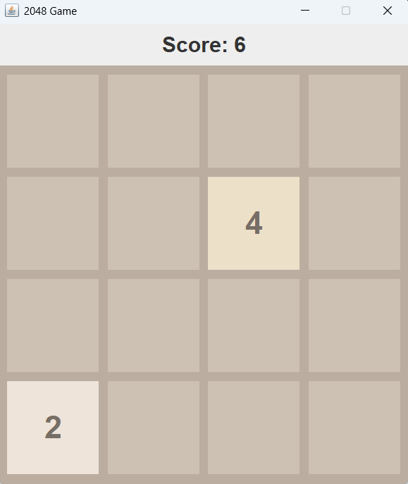

# 2048-Java-Game

This is a Java Swing implementation of the popular 2048 Game.
Players can slide numbered tiles on a 4x4 grid to combine them and reach the 2048 tile.

Developed using Java Swing for the GUI.

Includes dynamic board size selection and keyboard controls.

Fully functional desktop application.

Features

Classic 2048 gameplay with GUI.

Score tracking.

Undo/Redo functionality (if implemented).

Customizable board size (optional).

Requirements

Java JDK 8 or above

IDE or terminal to run Java files

## Screenshots

### Game Board

### Gameplay

### Game Over

